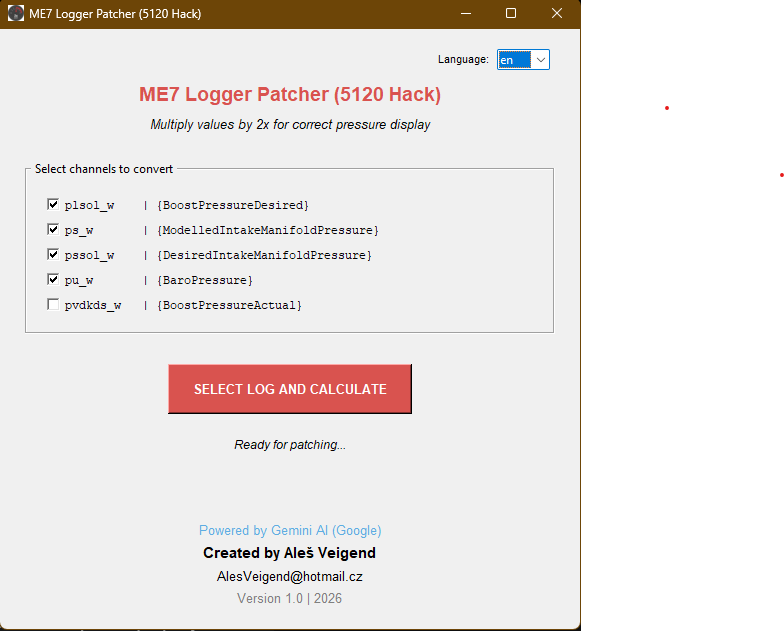

# 5120_log_converter
ME7 Logger Patcher (5120 Hack) 🚗💨
A simple and effective tool for the VAG tuning community. This application automates the process of doubling pressure values in ME7 logs, specifically designed for ECUs using the 5120 hack (where the 1,5b limit is bypassed by halving the values in the file).

🛠 What it does
When logging a "5120-hacked" ECU, the values for boost and manifold pressure are typically displayed as half of their real-world values. This tool patches your .csv logs by:

Identifying specific pressure channels.
Multiplying the values by 2x.
Saving a new, ready-to-analyze log file without touching your original data.

Automatic Detection: Supports multiple pressure variables based on standard ME7 Logger naming:

plsol_w {BoostPressureDesired}

ps_w {ModelledIntakeManifoldPressure}

pssol_w {DesiredIntakeManifoldPressure}

pu_w {BaroPressure}

pvdkds_w {BoostPressureActual}

Multi-language Support: Automatically detects System Language (Czech/English) or allows manual switching.

Safety First: Creates a new file with the -doubled- suffix, keeping your source data safe.

Portable: Standalone .exe version available (no Python installation needed).

